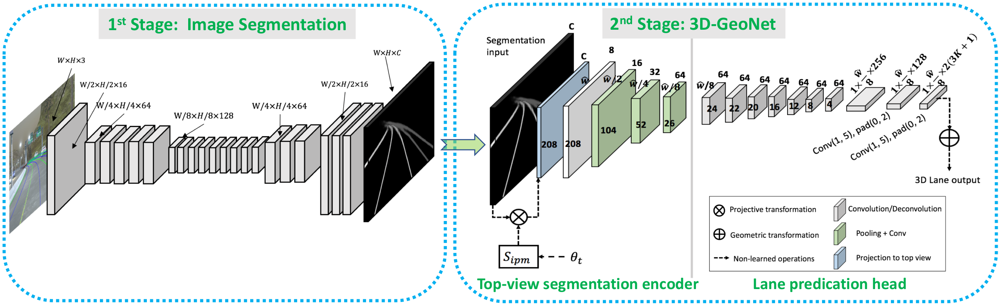
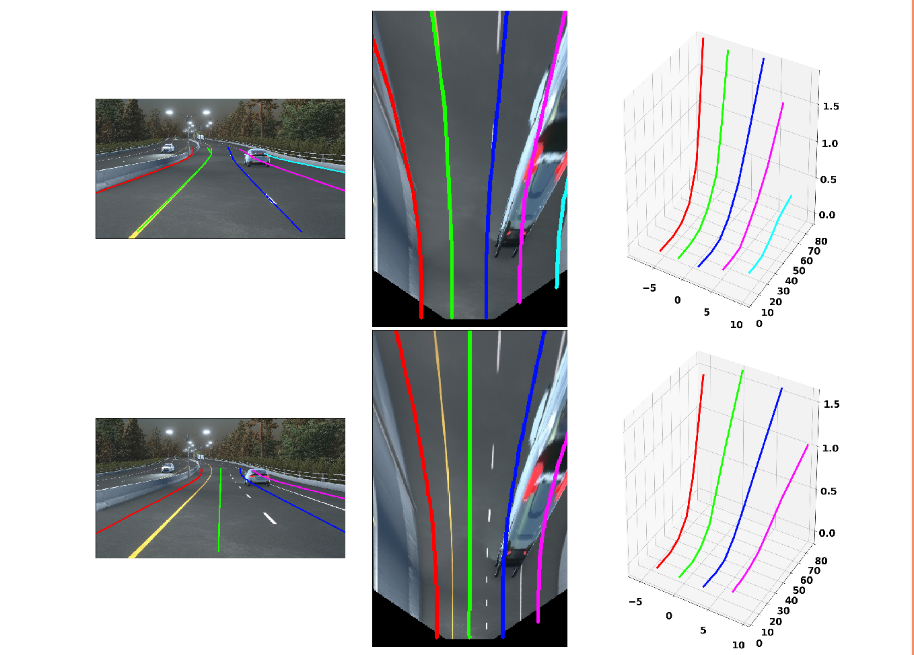
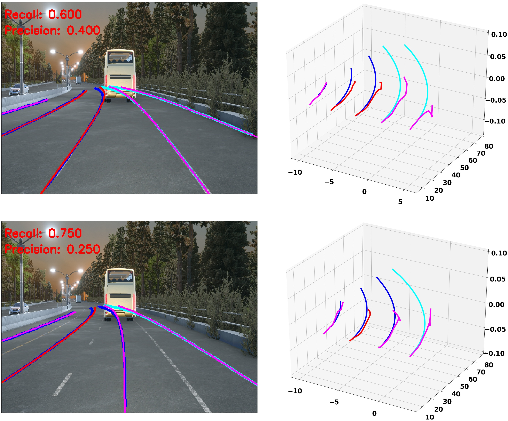
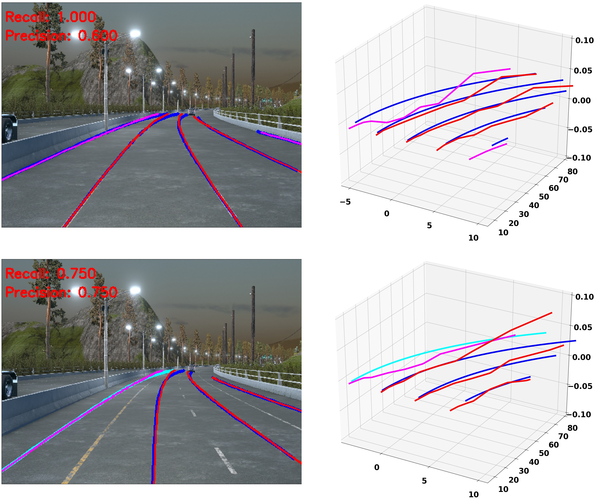
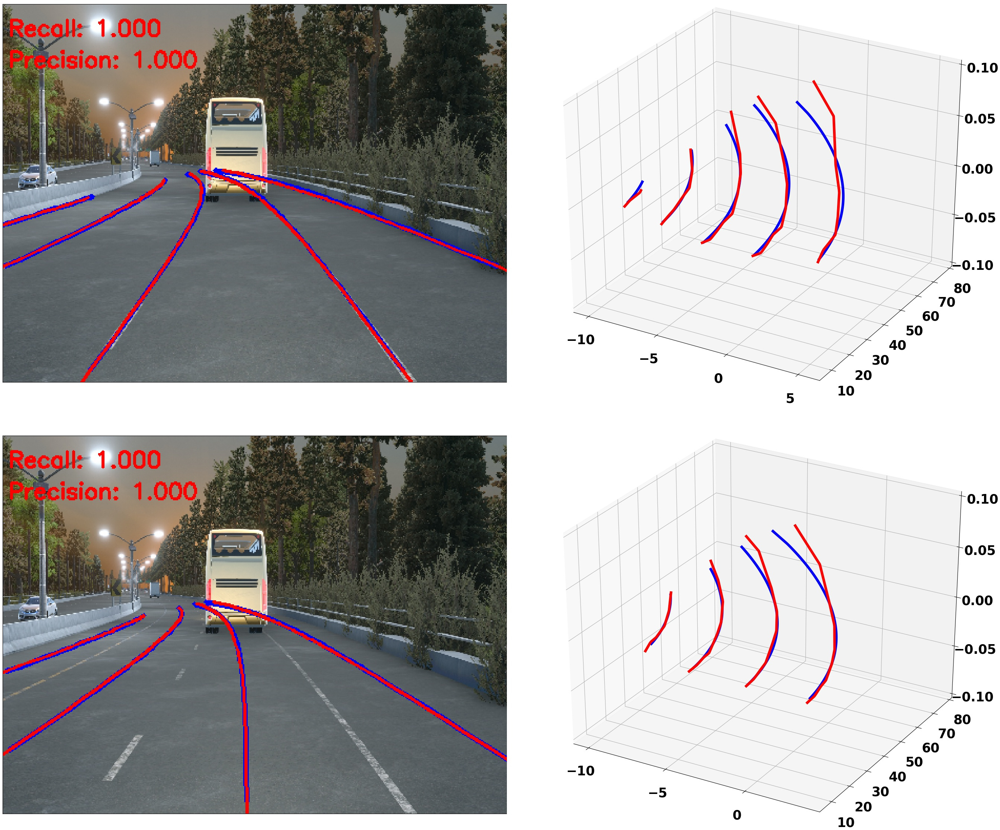
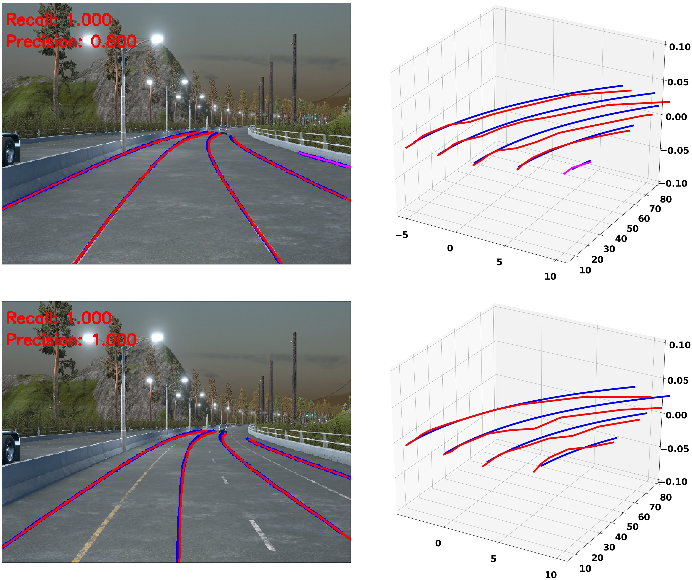

# (pytorch) Gen-LaneNet: a generalized and scalable approach for 3D lane detection 

## Introduction

This is a pytorch implementation of Gen-LaneNet, which predicts 3D lanes from a single image. Specifically, Gen-LaneNet
is a unified network solution that solves image encoding, spatial transform of features and 3D lane prediction simultaneously.
The method refers to the ECCV 2020 paper:

'Gen-LaneNet: a generalized and scalable approach for 3D lane detection', Y Guo, etal. ECCV 2020. [[eccv](https://www.ecva.net/papers/eccv_2020/papers_ECCV/papers/123660664.pdf)][[arxiv](https://arxiv.org/abs/2003.10656)]

Key features:

* A geometry-guided lane anchor representation generalizable to novel scenes.

* A scalable two-stage framework that decouples the learning of image segmentation subnetwork and geometry encoding subnetwork.

* A synthetic dataset for 3D lane detection [[repo](https://github.com/yuliangguo/3D_Lane_Synthetic_Dataset)].

  

## Another baseline
This repo also includes an unofficial implementation of '3D-LaneNet' in pytorch for comparison. The method refers to

"3d-lanenet:  end-to-end 3d multiple lane detection", N. Garnet, etal., ICCV 2019. [[paper](https://arxiv.org/abs/1811.10203)]

## Requirements
If you have Anaconda installed, you can directly import the provided environment file.

    conda env update --file environment.yaml

Those important packages includes:
* opencv-python             4.1.0.25
* pytorch                   1.4.0
* torchvision               0.5.0
* tensorboard               1.15.0
* tensorboardx              1.7
* py3-ortools               5.1.4041

## Data preparation

The 3D lane detection method is trained and tested on the 
[3D lane synthetic dataset](https://github.com/yuliangguo/3D_Lane_Synthetic_Dataset). Running the demo
code on a single image should directly work. However, repeating the training, testing and evaluation requires to prepare the dataset:
* Download the raw dataset [[google drive](https://drive.google.com/open?id=1Kisxoj7mYl1YyA_4xBKTE8GGWiNZVain)] [[baidu netdisk](https://pan.baidu.com/s/1y_d73-SaNreesif5nVXIVg?pwd=a852)]. 
* Download the prepared [data splits and pretrained models](https://drive.google.com/open?id=1GDgiAmJdP_BEluAZDgMaclNwb34OenCn). 
* Put 'data_splits' in current directory.

If you prefer to build your own data splits using the dataset, please follow the steps described in the 3D lane 
synthetic dataset repository. All necessary codes are included here already. 

## Run the Demo

    python main_demo_GenLaneNet_ext.py

Specifically, this code predict 3D lane from an image given known camera height and pitch angle. Pretrained models for the
 segmentation subnetwork and the 3D geometry subnetwork are loaded. Meanwhile, anchor normalization parameters wrt. 
 the training set are also loaded. The demo code will produce lane predication from a single 
image visualized in the following figure.

  

The lane results are visualized in three coordinate frames, respectively image plane, virtual top-view, and ego-vehicle
 coordinate frame. The lane-lines are shown in the top row and the center-lines are shown in the bottom row. 

## How to train the model

Step 1: Train the segmentation subnetwork

The training of Gen-LaneNet requires to first train the segmentation subnetwork, ERFNet.
* The training of the ERFNet is based on a pytorch implementation [[repo](https://github.com/yuliangguo/Codes-for-Lane-Detection/tree/sim_data_adaption/ERFNet-CULane-PyTorch)]
modified to train the model on the 3D lane synthetic dataset.

* The trained model should be saved as 'pretrained/erfnet_model_sim3d.tar'. A pre-trained model is already included. 

Step 2: Train the 3D-geometry subnetwork

    python main_train_GenLaneNet_ext.py

* Set 'args.dataset_name' to a certain data split to train the model.
* Set 'args.dataset_dir' to the folder saving the raw dataset. 
* The trained model will be saved in the directory corresponding to 
certain data split and model name, e.g. 'data_splits/illus_chg/Gen_LaneNet_ext/model*'. 
* The anchor offset std will be recorded for certain data split at the same time, e.g. 'data_splits/illus_chg/geo_anchor_std.json'.

The training progress can be monitored by tensorboard as follows.
    
    cd datas_splits/Gen_LaneNet_ext
    ./tensorboard  --logdir ./

## Batch testing

    python main_test_GenLaneNet_ext.py

* Set 'args.dataset_name' to a certain data split to test the model.
* Set 'args.dataset_dir' to the folder saving the raw dataset.
  
The batch testing code not only produces the prediction results, e.g., 
'data_splits/illus_chg/Gen_LaneNet_ext/test_pred_file.json', but also perform full-range precision-recall evaluation to 
produce AP and max F-score.

## Other methods

In './experiments', we include the training codes for other variants of Gen-LaneNet models as well as for the baseline method
[3D-LaneNet](https://arxiv.org/abs/1811.10203) as well as its extended version integrated with the new anchor proposed in Gen-LaneNet.
Interested users are welcome to repeat the full set of ablation study reported in the gen-lanenet paper. For example, to train 3D-LaneNet:
 
    cd experiments
    python main_train_3DLaneNet.py

## Evaluation

Stand-alone evaluation can also be performed.

    cd tools
    python eval_3D_lane.py

Basically, you need to set 'method_name' and 'data_split' properly to compare the predicted lanes against ground-truth
lanes. Evaluation details can refer to the [3D lane synthetic dataset](https://github.com/yuliangguo/3D_Lane_Synthetic_Dataset) 
repository or the Gen-LaneNet paper. Overall, the evaluation metrics include:
 * Average Precision (AP)
 * max F-score
 * x-error in close range (0-40 m)
 * x-error in far range (40-100 m)
 * z-error in close range (0-40 m)
 * z-error in far range (40-100 m)

We show the evaluation results comparing two methods: 
* "3d-lanenet:  end-to-end 3d multiple lane detection", N. Garnet, etal., ICCV 2019
* "Gen-lanenet: a generalized and scalable approach for 3D lane detection", Y. Guo, etal., Arxiv, 2020 (GenLaneNet_ext in code)

Comparisons are conducted under three distinguished splits of the dataset. For simplicity, only lane-line results are reported here.
The results from the code could be marginally different from that reported in the paper due to different random splits.

- **Standard**

| Method                 | AP     | F-Score | x error near (m) | x error far (m) | z error near (m) | z error far (m) |
|------------------------|:---------:|:---------:|:---------:|:---------:|:---------:|:---------:|
| 3D-LaneNet             |   89.3    | 86.4      | 0.068     | 0.477     | 0.015     | 0.202
| Gen-LaneNet            |   90.1    | 88.1      | 0.061     | 0.496     | 0.012     | 0.214

- **Rare Subset**

| Method                 | AP     | F-Score | x error near (m) | x error far (m) | z error near (m) | z error far (m) |
|------------------------|:---------:|:---------:|:---------:|:---------:|:---------:|:---------:|
| 3D-LaneNet             |  74.6     | 72.0      | 0.166     | 0.855     | 0.039     | 0.521
| Gen-LaneNet            |  79.0     | 78.0      | 0.139     | 0.903     | 0.030     | 0.539

- **Illumination Change**

| Method                 | AP     | F-Score | x error near (m) | x error far (m) | z error near (m) | z error far (m) |
|------------------------|:---------:|:---------:|:---------:|:---------:|:---------:|:---------:|
| 3D-LaneNet             |   74.9    | 72.5      | 0.115     | 0.601     | 0.032     | 0.230
| Gen-LaneNet            |   87.2    | 85.3      | 0.074     | 0.538     | 0.015     | 0.232

## Visualization

Visual comparisons to the ground truth can be generated per image when setting 'vis = True' in 'tools/eval_3D_lane.py'.
We show two examples for each method under the data split involving illumination change.

* 3D-LaneNet

 

* Gen-LaneNet

 

## Citation
Please cite the paper in your publications if it helps your research: 

    @article{guo2020gen,
      title={Gen-LaneNet: A Generalized and Scalable Approach for 3D Lane Detection},
      author={Yuliang Guo, Guang Chen, Peitao Zhao, Weide Zhang, Jinghao Miao, Jingao Wang, and Tae Eun Choe},
      booktitle={Computer Vision - {ECCV} 2020 - 16th European Conference},
      year={2020}
    }

## Copyright and License

The copyright of this work belongs to Baidu [Apollo](https://github.com/ApolloAuto/apollo), 
which is provided under the [Apache-2.0 license](https://github.com/ApolloAuto/apollo/blob/master/LICENSE).

