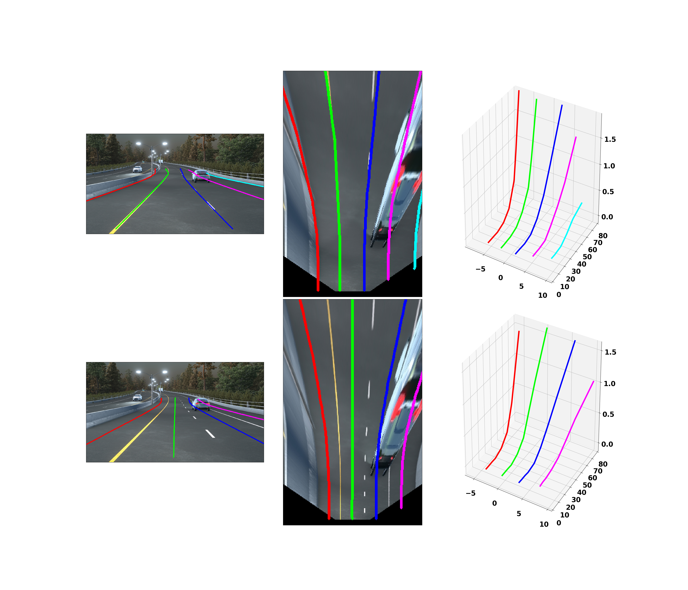

# Gen-LaneNet: a generalized and scalable approach for 3D lane detection (pytorch)

## Introduction

This is a pytorch implementation of the paper:

'Gen-laneNet: a generalized and scalable approach for 3D lane detection', Y Guo, etal. Arxiv 2020 [[paper](https://arxiv.org/abs/2003.10656)]

Key features:

(1) A geometry-guilded lane anchor representation that is well-generalized to novel scenes.

(2) A scalable two-stage framework that decouples the learning of image segmentation subnetwork and geometry encoding subnetwork.

(3) A synthetic dataset for 3D lane detection.

  

## Another baseline
Another baseline method, '3D-LaneNet' is unofficially implemented in pytorch for comparison:

"3d-lanenet:  end-to-end 3d multiple lane detection", N. Garnet, etal., ICCV 2019

## Requirements
If you have Anaconda installed, you can directly import the provided environment file.

    conda env update --file environment.yaml

Those important packages includes:
* python                    3.7.3
* numpy                     1.16.2
* scipy                     1.2.1 
* matplotlib                3.0.3 
* opencv-python             4.1.0.25
* py3-ortools               5.1.4041
* pytorch                   1.4.0
* torchvision               0.5.0
* tensorboard               1.15.0
* tensorboardx              1.7

## Data preparation

The 3D lane detection method is trained and tested on the 
[3D lane synthetic dataset](https://github.com/yuliangguo/3D_Lane_Synthetic_Dataset) released from the paper. Running demo
code on a single image should directly work. However, repeating the training, testing and evaluation requires to prepare the dataset:
* Download the [raw datasets](https://drive.google.com/open?id=1Kisxoj7mYl1YyA_4xBKTE8GGWiNZVain). The location
is referred as 'dataset_dir' in the code.
* Download the prepared [data splits and pretrained models](https://drive.google.com/open?id=1GDgiAmJdP_BEluAZDgMaclNwb34OenCn). 
* Put 'data_splits' in current directory.

If you prefer to build your own data splits using the dataset, please follow the steps described in the github repository
of the 3D lane synthetic dataset. All necessary codes are included here already. 

## Run the Demo

    python main_demo_GenLaneNet_ext.py

Specifically, this code predict 3D lane from an image given known camera height and pitch angle. Because, gen-lanenet is
a two-stage framework, pretrained models for segmentation subnetwork and geometry subnetwork are loaded. Meanwhile, anchor
normalization parameters wrt. the training set are also loaded. The demo code produces lane predication from a single 
image visualized in the following figure.

  

The results are shown in three coordinate frames respectively. The lane-lines are shown in the top row and the 
center-lines are shown in the bottom row. 

## How to train the model

    python main_train_GenLaneNet_ext.py

It is necessary to modify the code to set data split in 'args.dataset_name', and the location saving the 
raw dataset in 'args.dataset_dir' properly. The trained model will be saved in the directory corresponding to 
certain data split and model name, e.g. 'data_splits/illus_chg/Gen_LaneNet_ext/model*'. The anchor offset std will be recorded
for certain data split at the same time, e.g. 'data_splits/illus_chg/geo_anchor_std.json'.

The training progress can be monitored by tensorboard as follows.
    
    cd datas_splits/Gen_LaneNet_ext
    ./tensorboard  --logdir ./
    
The training of Gen-LaneNet requires to first train the segmentation subnetwork, saved as 'pretrained/erfnet_model_sim3d.tar'.
ERFNet is trained on the 3D lane synthetic dataset via modifying a pytorch implementation [[code](https://github.com/yuliangguo/Codes-for-Lane-Detection/tree/master/ERFNet-CULane-PyTorch)].

We include training code for other variants of Gen-LaneNet models as well as for the baseline 
[3D-LaneNet](https://arxiv.org/abs/1811.10203) in './tools/'. Interested users are welcome to repeat the full set
 of ablation study reported in the gen-lanenet paper.

## Batch testing

    python main_test_GenLaneNet_ext.py
    
Similarly, it is necessary to modify the code to set 'args.dataset_name', and 'args.dataset_dir' properly. 
Different from the validation code in training, the batch testing code not only produce the prediction results, e.g., 
'data_splits/illus_chg/Gen_LaneNet_ext/test_pred_file.json', but also perform full-range precision-recall evaluation to 
produce AP and max F-score.

## Evaluation

Stand-alone evaluation can be performed by

    cd tools
    python eval_3D_lane.py

Basically, you need to set 'method_name' and 'data_split' properly to compare the predicted lanes against ground-truth
lanes. Details can refer to the [3D lane synthetic dataset](https://github.com/yuliangguo/3D_Lane_Synthetic_Dataset) repository.

We show the evaluation results comparing two methods: 
* "3d-lanenet:  end-to-end 3d multiple lane detection", N. Garnet, etal., ICCV 2019
* "Gen-lanenet: a generalized and scalable approach for 3D lane detection", Y. Guo, etal., Arxiv, 2020 (GenLaneNet_ext in code)

Comparisons are conducted under three distinguished splits of the dataset. For simplicity, only lane-line results are reported here.
The results from the code is slightly different from that reported in the paper due to different random splits.

- **Standard**

| Method                 | AP     | F-Score | x error near (m) | x error far (m) | z error near (m) | z error far (m) |
|------------------------|:---------:|:---------:|:---------:|:---------:|:---------:|:---------:|
| 3D-LaneNet             |   89.3    | 86.4      | 0.068     | 0.477     | 0.015     | 0.202
| Gen-LaneNet            |   90.1    | 88.1      | 0.061     | 0.496     | 0.012     | 0.214

- **Rare Subset**

| Method                 | AP     | F-Score | x error near (m) | x error far (m) | z error near (m) | z error far (m) |
|------------------------|:---------:|:---------:|:---------:|:---------:|:---------:|:---------:|
| 3D-LaneNet             |  74.6     | 72.0      | 0.166     | 0.855     | 0.039     | 0.521
| Gen-LaneNet            |  79.0     | 78.0      | 0.139     | 0.903     | 0.030     | 0.539

- **Illumination Change**

| Method                 | AP     | F-Score | x error near (m) | x error far (m) | z error near (m) | z error far (m) |
|------------------------|:---------:|:---------:|:---------:|:---------:|:---------:|:---------:|
| 3D-LaneNet             |   74.9    | 72.5      | 0.115     | 0.601     | 0.032     | 0.230
| Gen-LaneNet            |   87.2    | 85.3      | 0.074     | 0.538     | 0.015     | 0.232

## Visualization

Visual comparisons to the ground truth can be generated per image when setting 'vis = True' in eval_3D_lane.py.
We show two examples for each method under the data split involving illumination change.

* 3D-LaneNet

 

* Gen-LaneNet

 

## Citation
Please cite the paper in your publications if it helps your research: 

    @article{guo2020gen,
      title={Gen-LaneNet: A Generalized and Scalable Approach for 3D Lane Detection},
      author={Yuliang Guo, Guang Chen, Peitao Zhao, Weide Zhang, Jinghao Miao, Jingao Wang, and Tae Eun Choe},
      journal={arXiv},
      pages={arXiv--2003},
      year={2020}
    }

